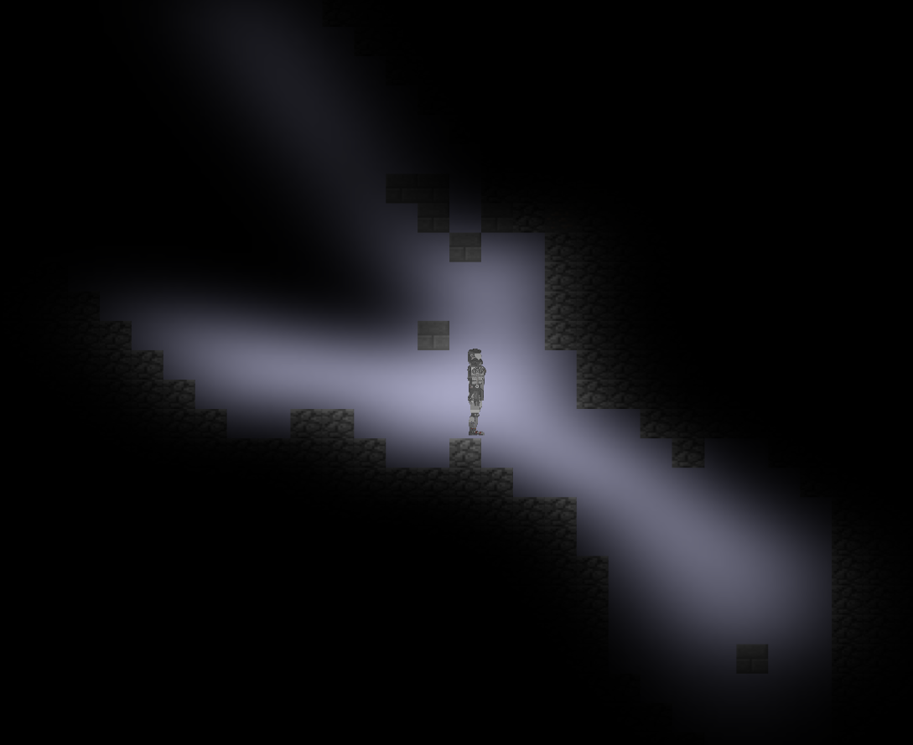

# Tropadom2
## Description
A 2D sandbox game similar to games like Terraria.  Players can roam in a world that is 2^64 blocks long and about 600 blocks tall.
The world is populated with different blocks and utilizes LightingV4 for smooth and efficient dynamic lighting.

## Game Images

Player standing in randomly generated caves with a light source dyamically lighting the blocks around him.


Two instances of Tropadom2 where world information is synced and updated.  The lines represent places the player can collide with and where light should be blocked.  The rectangles are the two players.

## Building
***Clone repository with --recurse-submodules flag***  
Requirements: Boost (1.68.0), Allegro (5.2.4), Box2D (2.3.1), and Protobuf (3.6.1)  

#### Requirement Installation
1. Installing Boost
    1. Download from https://www.boost.org/  
    2. In boost root directory, run ```./bootstrap```  
    3. For default configuration compatibility run: ```./b2 --stagedir=./stage/VS2017/x64 address-model=64 --toolset=msvc-14.1 --with-thread variant=release link=static threading=multi runtime-link=static```  
    4. Add the boost root directory to CMAKE_INCLUDE_PATH and the directory of your boost library files (should be in stage/lib) to CMAKE_LIBRARY_PATH.
2. Installing Google Protocol Buffers
    1. Download from https://github.com/protocolbuffers/protobuf/releases/tag/v3.6.1
    2. In protobuf root directory, make a /install and /cmake/build directory
    3. In /cmake/build run ```cmake  ../.. -G "Visual Studio 15 2017" -A x64 -T host=x64 -DCMAKE_BUILD_TYPE=Release -DCMAKE_INSTALL_PREFIX=../../install```
    4. Run make or build solution
    5. Add (protobuf root)/src to CMAKE_INCLUDE_PATH and the directory of your protobuf library files (should be in (protobuf root)/cmake/build/lib/release/Release) to CMAKE_LIBRARY_PATH
3. Installing Box2D
    1. Download from https://github.com/erincatto/Box2D
    2. Install [Premake5](https://premake.github.io/)
    3. Run ```premake5 vs2017 --StaticRuntime```
    4. Run visual studio solution or make
4. Installing Allegro
    * Windows:
        1. After you generate the FarmerGame solution, goto Tools -> NuGet Packet Manager -> Manage NuGet Packages for Solution... -> Browse
        2. Search for and install Allegro for AllegroExt, Lighting4, and Tropadom2
        3. Goto the properties for the Allegro projects and set the dependencies like this 
    * Ubuntu:
        1. Install Allegro5 Package with [this guide](https://wiki.allegro.cc/index.php?title=Install_Allegro_from_Ubuntu_PPAs)

#### Build
```
mkdir build
cd build
cmake .. -G "Visual Studio 15 2017" -A x64 -T host=x64 -Dboxlibdir="(Box2D Directory)\Build\bin\x86_64\Release\" -Dboxincludedir="(Box2D Directory)"        #For Ubuntu don't include -G option
```
Run make or build the solution  
Set Tropadom2 as Startup Project after building on Visual Studio

#### Troubleshooting
* If using Visual Studio, make sure all projects are using /MT runtime linking and Basic Runtime Checks is set to default.
